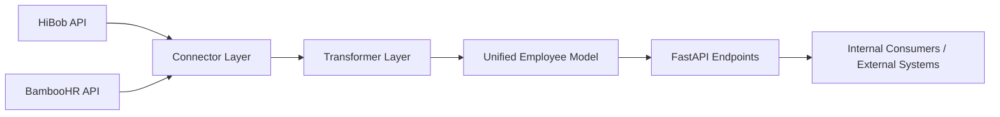

# HRTech Integration Hub

Integration layer for HR systems such as HiBob and BambooHR, designed to normalize employee data and expose a clean API surface for downstream enterprise tools.

## 1) Idea

Modern HR tech landscapes are fragmented. Organizations often run more than one HR platform across regions, business units, or post-merger environments. This project introduces an integration hub that:

- Connects to multiple HR platforms through dedicated connectors.
- Normalizes provider-specific payloads into a shared employee model.
- Exposes stable API endpoints for sync and event ingestion workflows.

## 2) Purpose

The primary goal is to reduce integration complexity and avoid repeated one-off transformations in each downstream service.

With this hub, engineering teams can:

- Centralize HR connector logic in one place.
- Standardize employee profile shape across providers.
- Build reliable sync and webhook pipelines incrementally.

## 3) Current Capabilities

- FastAPI service with health and integration endpoints.
- HiBob connector with employee fetching and active employee filtering.
- BambooHR connector with employee directory and time-off request methods.
- Employee transformer utilities to map provider payloads to a unified model.
- Basic unit tests for HiBob mapping/filtering and employee transformation.

## 4) Typical Use Cases

- Employee profile sync into IAM, payroll-adjacent systems, data warehouse, or internal tools.
- Event-driven integration where HR platform webhooks trigger downstream workflows.
- Unified employee record creation for analytics and cross-system reporting.
- Rapid prototyping of additional HR connectors using a common base client.

## 5) High-Level Architecture



## 6) Project Structure

```text
hrtech-integration-hub/
	src/
		app.py
		base_client.py
		connectors/
			hibob.py
			bamboohr.py
		transformers/
			employee_mapper.py
	tests/
		test_hibob.py
		test_employee_mapper.py
	requirements.txt
	README.md
```

## 7) Technology Stack

- Python 3.11+
- FastAPI
- Uvicorn
- httpx
- tenacity
- pydantic
- python-dotenv
- structlog
- pytest

## 8) Installation

### Prerequisites

- Python 3.11 or newer
- pip

### Steps

1. Clone the repository.
2. Move to the project directory.
3. Create and activate a virtual environment.
4. Install dependencies.

#### Windows (PowerShell)

```powershell
python -m venv .venv
.\.venv\Scripts\Activate.ps1
pip install -r requirements.txt
```

#### macOS / Linux

```bash
python3 -m venv .venv
source .venv/bin/activate
pip install -r requirements.txt
```

## 9) Configuration

Set the following environment variables before running provider-integrated flows:

- `HIBOB_API_KEY`
- `BAMBOOHR_API_KEY`
- `BAMBOOHR_SUBDOMAIN`

Example (PowerShell):

```powershell
$env:HIBOB_API_KEY="your_hibob_api_key"
$env:BAMBOOHR_API_KEY="your_bamboohr_api_key"
$env:BAMBOOHR_SUBDOMAIN="your_subdomain"
```

Example (bash):

```bash
export HIBOB_API_KEY="your_hibob_api_key"
export BAMBOOHR_API_KEY="your_bamboohr_api_key"
export BAMBOOHR_SUBDOMAIN="your_subdomain"
```

## 10) Run the Service

```bash
uvicorn src.app:app --reload
```

Service URL (default):

- `http://127.0.0.1:8000`

Swagger/OpenAPI docs:

- `http://127.0.0.1:8000/docs`

## 11) Available API Endpoints

- `GET /health`
	- Basic health check.

- `POST /webhooks/hibob`
	- Accepts a webhook payload and returns a simple acknowledgment with event type.

- `POST /sync/employees`
	- Placeholder endpoint indicating where employee sync orchestration will be implemented.

## 12) Run Tests

```bash
python -m pytest -q
```

## 13) Future Extensions

- Implement full `sync_employees` orchestration with provider fan-in and target fan-out.
- Add persistence and state management (last sync checkpoints, idempotency keys, retries ledger).
- Add background job execution (Celery/RQ/Arq) for non-blocking sync operations.
- Add outbound connectors (Slack, Workday, AD/Okta, data warehouse sinks).
- Add schema validation and stronger payload typing with pydantic request/response models.
- Add authentication/authorization for API endpoints.
- Add observability stack (structured logs, metrics, traces, alert hooks).
- Expand tests to include connector HTTP mocking, error paths, and integration tests.
- Add containerization and deployment manifests (Docker, Kubernetes, CI/CD pipeline).

## 14) Operational Recommendations

- Use secret managers for API keys instead of plain environment files in production.
- Add rate limiting and circuit breaking for upstream API stability.
- Introduce request correlation IDs across webhook and sync flows.
- Define a canonical employee schema versioning strategy for backward compatibility.

## 15) License

This project is licensed under the terms provided in [LICENSE](LICENSE).
